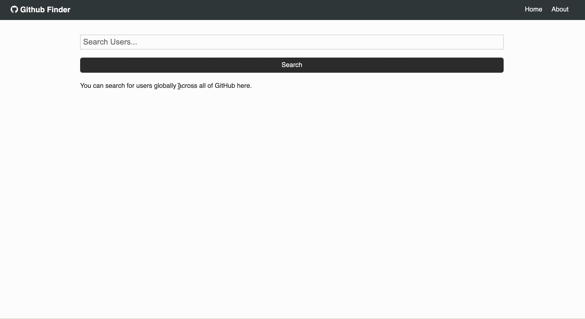
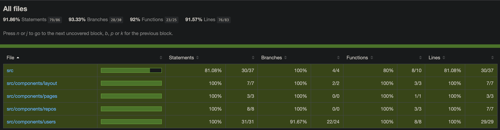

## Github Finder

App to search Github users. Helps to search for users globally.



#

## Getting Started

Clone the repo:

```bash
git clone
cd rdc-x
```

Install dependencies and run server:

```bash
npm install
npm start
```

Run Unit Test

```bash
npm run test
```

Run Unit Test Coverage

```bash
npm run test -- --coverage --watchAll=false
```

Build

```bash
npm run build
```

#

## Code Coverage

App has the unit test code coverage of 91%



#

## Lighthouse Score

App has a decent lighthouse score.


